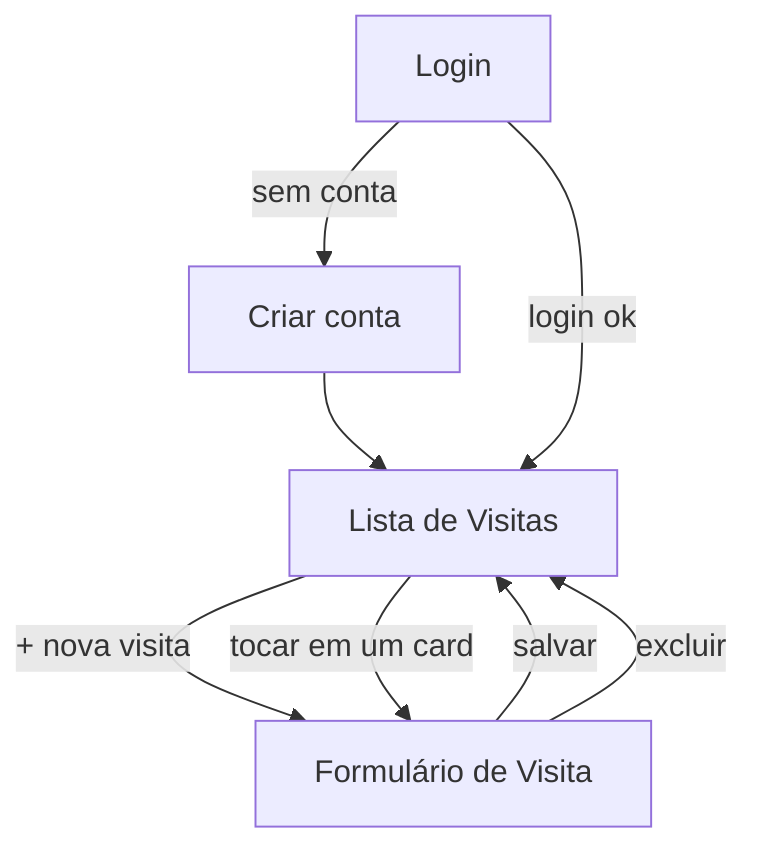

# Escopo do Projeto — Visita Técnica

> Documento de escopo (entregável da Semana 1). Preencha os campos marcados
> com `[...]` com as decisões reais da dupla — o conteúdo abaixo é um ponto
> de partida coerente com o formulário em uso hoje pela equipe de campo.

## 1. Problema

A equipe técnica registra as visitas (instalação, manutenção e orçamento)
em um formulário do Google Forms preenchido no celular durante ou depois
da visita. Esse fluxo tem duas falhas conhecidas:

1. **Não funciona sem internet.** Em clientes com sinal fraco ou nenhum
   (subsolos, áreas rurais, prédios com bloqueio de sinal), o técnico
   precisa lembrar de preencher o formulário depois — e às vezes esquece
   ou perde os detalhes (horário exato, número da OS).
2. **Sem histórico consultável em campo.** O Google Forms só registra
   respostas; não há como o técnico (ou a central) consultar, no
   celular, quais visitas já foram feitas, quando, e por quem.

## 2. Público-alvo

Técnicos de campo de uma pequena equipe de manutenção/instalação
(no formulário atual: Celio, Lucas, Eduardo, Maicon e João) e a pessoa
responsável por acompanhar as ordens de serviço (OS) da equipe.

## 3. Proposta de valor

Um app simples que **substitui o papel/Google Forms** por um registro de
visita que:
- Funciona offline (o técnico registra a visita no momento, mesmo sem
  sinal, e o app envia para a nuvem depois, sozinho);
- Mostra o histórico de visitas já registradas, com status de envio
  visível (pendente / sincronizado / falhou);
- Permite editar uma visita registrada por erro de digitação, sem
  precisar abrir um novo formulário.

## 4. Escopo do MVP (o que entra nas 4 semanas)

**Entra:**
- Login/cadastro com e-mail e senha (Firebase Authentication).
- Cadastro de visita com os mesmos campos do formulário atual: Nome do
  Cliente, Número da OS, Data da visita, Horário de chegada, Técnico
  responsável, Horário de saída, Tipo de visita (Instalação/Manutenção/Orçamento).
- Listagem das visitas registradas, mais recentes primeiro.
- Edição e exclusão de uma visita.
- Persistência local (SQLite) — o app funciona 100% para cadastro,
  listagem e edição sem internet.
- Sincronização com Firestore quando há conexão (automática + botão
  manual "sincronizar agora").
- Indicação visual de: carregando, sucesso, erro, sem conexão, e status
  de sincronização por registro.

**Não entra nesta versão (fora do escopo do MVP — possíveis evoluções):**
- Fotos anexadas à visita.
- Assinatura do cliente na tela.
- Relatórios/gráficos de produtividade por técnico.
- Múltiplos "times"/empresas no mesmo app (multi-tenant).
- Notificações push.

## 5. Fluxo de navegação

- **Login / Criar conta**: telas de autenticação (Firebase Auth).
- **Lista de Visitas**: tela principal após login. Mostra status de
  conexão/sincronização no topo e a lista de visitas.
- **Formulário de Visita**: uma única tela cuida de criar e editar
  (recebe um id opcional; sem id = nova visita).

## 6. Decisões técnicas (resumo — detalhes no README.md)

| Decisão | Escolha | Por quê |
|---|---|---|
| Persistência local | SQLite (`expo-sqlite`) | Permite consultas/ordeniação reais; AsyncStorage não seria suficiente para listar/filtrar com performance |
| Backend | Firebase Auth + Firestore | Indicado pelo professor para uso com Expo Go (JS SDK) |
| Estratégia offline-first | Toda escrita vai primeiro pro SQLite; sincronização é "best-effort" em segundo plano | A tela nunca espera a rede para responder |
| Resolução de conflito | Last-write-wins por timestamp `updatedAt` | Simples e suficiente para o volume de uma pequena equipe; limitação documentada no README |

## 7. Cronograma (4 encontros)

| Semana | Foco | Entregável |
|---|---|---|
| 1 | Escopo e protótipo | Este documento + fluxo de navegação |
| 2 | Estrutura técnica | Projeto Expo, navegação, Firebase configurado, schema do SQLite definido |
| 3 | CRUD e sincronização | CRUD completo funcionando local + sync com Firestore |
| 4 | Refinamento e apresentação | Tratamento de erros, README final, demo online/offline |

## 8. Divisão de tarefas da dupla

| Integrante | Responsabilidades |
|---|---|
| `[Nome 1]` | `[ex.: telas e navegação, UI dos componentes]` |
| `[Nome 2]` | `[ex.: persistência local, sincronização com Firebase]` |

> Em um projeto pequeno como este, é normal que as duas pessoas passem
> por todas as camadas em algum momento — use esta tabela para registrar
> quem foi o principal responsável por revisar/testar cada parte.
