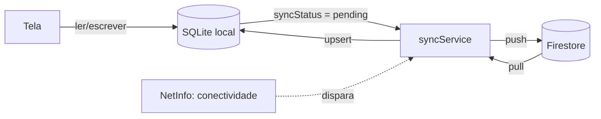

# Visita Técnica — App de checklist de visitas em campo

App React Native (Expo + TypeScript) para registrar visitas técnicas em
campo, com persistência local (offline-first) e sincronização com
Firebase. Projeto desenvolvido como MVP para a disciplina de
desenvolvimento mobile (cronograma de 4 encontros — ver `ESCOPO.md`).

> Veja `ESCOPO.md` para o problema, público-alvo, proposta de valor e
> escopo do MVP. Este arquivo documenta a parte técnica: como rodar,
> como o app é organizado e quais decisões/limitações existem.

## Stack

- **Expo SDK 56** + **React Native 0.86** + **TypeScript**
- **React Navigation** (native stack) para navegação
- **expo-sqlite** para persistência local (fonte de verdade do app)
- **Firebase JS SDK** (Authentication + Firestore) para backend
- **@react-native-community/netinfo** para detectar conectividade
- **@react-native-community/datetimepicker** para os campos de data/hora

## Como rodar

### 1. Pré-requisitos
- Node.js 20+
- App **Expo Go** instalado no celular (Android/iOS), ou um emulador
- Uma conta Google para criar o projeto Firebase (gratuito)

### 2. Instalar dependências
```bash
npm install
```

### 3. Criar e configurar o projeto Firebase
1. Acesse [console.firebase.google.com](https://console.firebase.google.com) e crie um projeto novo.
2. Em **Build > Authentication**, clique em "Get started" e habilite o
   provedor **E-mail/senha**.
3. Em **Build > Firestore Database**, clique em "Create database" (modo
   produção, escolha a região mais próxima).
4. Em **Firestore Database > Regras**, cole o conteúdo do arquivo
   `firestore.rules` deste repositório e publique.
5. Em **Configurações do projeto (ícone de engrenagem) > Geral**, role
   até "Seus apps", clique no ícone Web (`</>`) para registrar um app
   Web (sim, mesmo sendo um app mobile — o Firebase JS SDK usa a
   configuração de app Web) e copie os valores do objeto `firebaseConfig`.

### 4. Configurar as variáveis de ambiente
```bash
cp .env.example .env
```
Abra `.env` e cole os valores copiados do Firebase no passo anterior.

### 5. Iniciar o app
```bash
npx expo start
```
Escaneie o QR Code com o app **Expo Go** (Android) ou a câmera (iOS).

### Verificação de tipos
```bash
npm run typecheck
```

## Estrutura de pastas

```
App.tsx                     # inicializa o SQLite e monta os provedores
src/
  theme.ts                  # cores, espaçamento e tipografia compartilhados
  types/visit.ts            # tipo central "Visit" + tipos auxiliares
  services/
    firebase.ts              # inicialização do Firebase (Auth + Firestore)
    database.ts               # camada SQLite (CRUD local)
    syncService.ts            # push/pull de sincronização com Firestore
  hooks/
    useNetworkStatus.ts       # status de conectividade (NetInfo)
    useVisits.ts               # hook central de dados (CRUD + sync) usado pelas telas
  context/AuthContext.tsx     # estado de autenticação (Firebase Auth)
  navigation/                 # RootNavigator, AuthStack, AppStack
  components/                 # ChipSelect, TextField, DateTimeField,
                               # SyncStatusBadge, ConnectivityBanner,
                               # VisitCard, EmptyState, ErrorState, PrimaryButton
  screens/                     # LoginScreen, SignUpScreen, VisitListScreen, VisitFormScreen
  utils/authErrorMessages.ts  # tradução de erros do Firebase Auth
```

## Arquitetura: como funciona o offline-first

A regra de ouro do app é: **a tela nunca espera a rede**. Todo fluxo de
dados passa primeiro pelo SQLite local; o Firestore é tratado como um
espelho remoto que é atualizado em segundo plano.



1. **Criar/editar/excluir uma visita** grava direto no SQLite com
   `syncStatus: "pending"` (exclusão é "soft delete": marca `deletedAt`
   em vez de apagar a linha, para que a exclusão também possa ser
   sincronizada).
2. Depois de salvar localmente, o app **tenta** sincronizar em segundo
   plano (`syncNow`) — se não houver internet, essa tentativa
   simplesmente falha silenciosamente e os dados continuam disponíveis
   localmente, marcados como pendentes.
3. A sincronização também é disparada automaticamente quando o
   `useNetworkStatus` detecta que a conexão voltou, e pode ser feita
   manualmente pelo botão no banner de status.
4. **Resolução de conflito**: ao receber uma visita do servidor
   (`pull`), o app compara o timestamp `updatedAt`. Se existir uma
   edição local ainda não enviada e mais recente que a versão do
   servidor, a versão local é preservada (ela será enviada no próximo
   `push`). Essa é uma estratégia *last-write-wins* simples — ver
   limitações abaixo.

## Decisões técnicas e limitações conhecidas

Registro honesto de trade-offs feitos para manter o projeto viável em 4
encontros (útil para a apresentação técnica):

- **Sem tabela de fila de sincronização separada.** O próprio campo
  `syncStatus` na tabela `visits` faz esse papel. Mais simples de
  implementar e suficiente para o volume de uma pequena equipe; um app
  com volume bem maior de dados/edições simultâneas se beneficiaria de
  um padrão *outbox* dedicado.
- **Conflito é resolvido por registro inteiro, não por campo.** Se dois
  dispositivos editarem a mesma visita offline ao mesmo tempo, o que
  tiver o `updatedAt` mais recente sobrescreve o outro por completo —
  não há merge campo a campo (ex.: um dispositivo só mudou o horário de
  saída, o outro só mudou o tipo de visita: o merge "inteligente" dos
  dois não acontece nesta versão).
- **Cada usuário só vê suas próprias visitas** (`/users/{uid}/visits`).
  Decisão deliberada para manter as regras de segurança do Firestore
  simples desde o início. Se o requisito real for "todos os técnicos
  veem as visitas de todos", o modelo de dados precisa migrar para uma
  coleção única com um campo `createdBy` — ver comentário em
  `firestore.rules`.
- **Sem paginação.** `pullRemoteVisits` busca a coleção inteira a cada
  sincronização. Adequado para o volume esperado (checklist de uma
  pequena equipe); não escalaria para milhares de registros sem
  paginação/`limit()`+cursor.
- **Compatibilidade Firebase JS SDK + Metro.** Há um problema conhecido
  e bem documentado entre o Firebase JS SDK e a resolução de módulos do
  Metro a partir do Expo SDK 53 (erro `Component auth has not been
  registered yet`). O `metro.config.js` deste projeto já inclui a
  correção recomendada pela comunidade. Se uma versão futura do
  Expo/Firebase corrigir isso na raiz, a configuração deixa de ser
  necessária, mas mantê-la não tem efeito colateral conhecido neste
  projeto (não usamos monorepo).

## Como testar o comportamento offline

1. Abra o app com o celular conectado à internet e faça login.
2. Ative o **modo avião** (ou desligue o Wi-Fi/dados).
3. Cadastre, edite ou exclua uma visita — tudo continua funcionando, e
   o card/banner mostram o status "Pendente".
4. Desative o modo avião — a sincronização dispara automaticamente
   (ou toque no banner para sincronizar manualmente) e o status muda
   para "Sincronizado".
5. Para validar a sincronização entre dispositivos: repita o passo 1-4
   em outro aparelho (ou reinstale o app) logado com a mesma conta — as
   visitas sincronizadas devem aparecer.

## Próximos passos (fora do escopo do MVP)

- Fotos da visita (ex.: `expo-image-picker` + Firebase Storage)
- Assinatura do cliente na tela (captura de assinatura)
- Filtros na listagem (por técnico, tipo de visita, período)
- Fila de sincronização dedicada (outbox) para maior volume de dados
